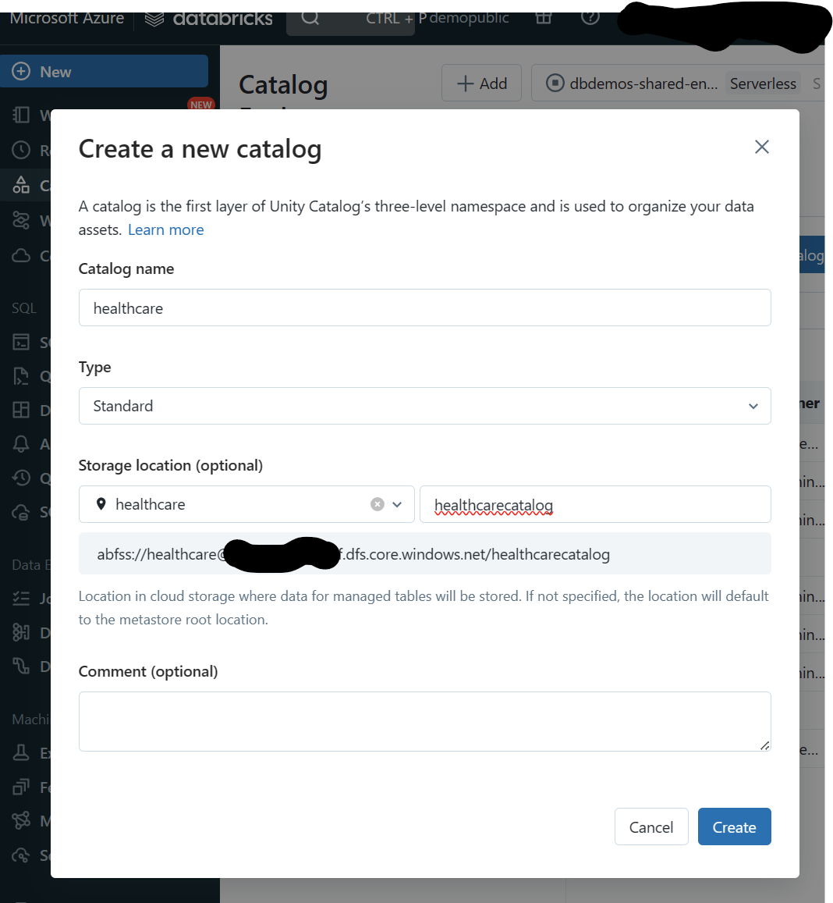
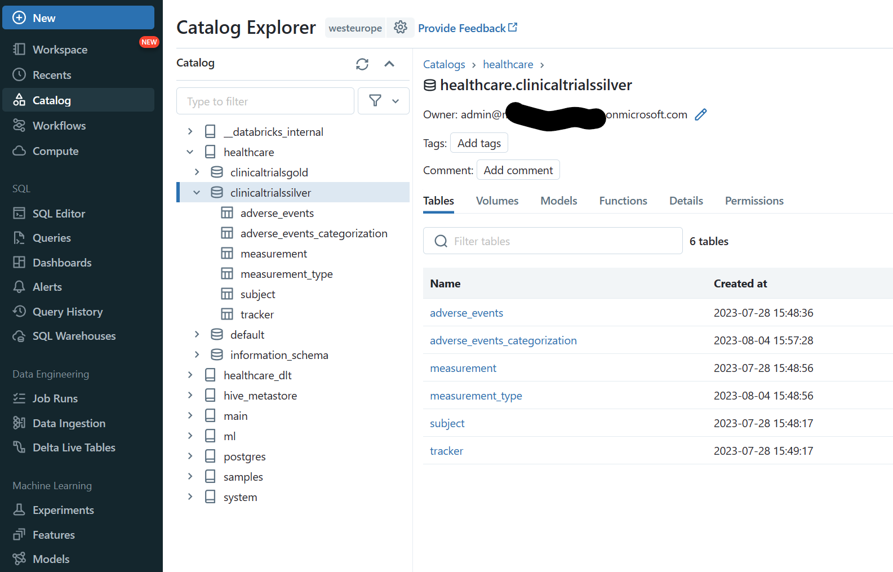
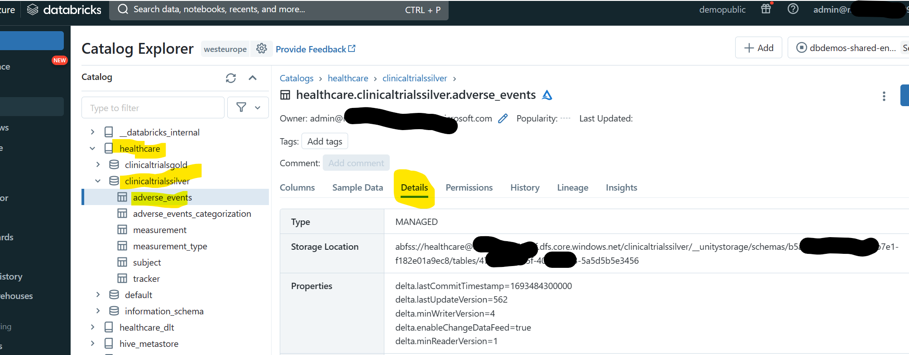
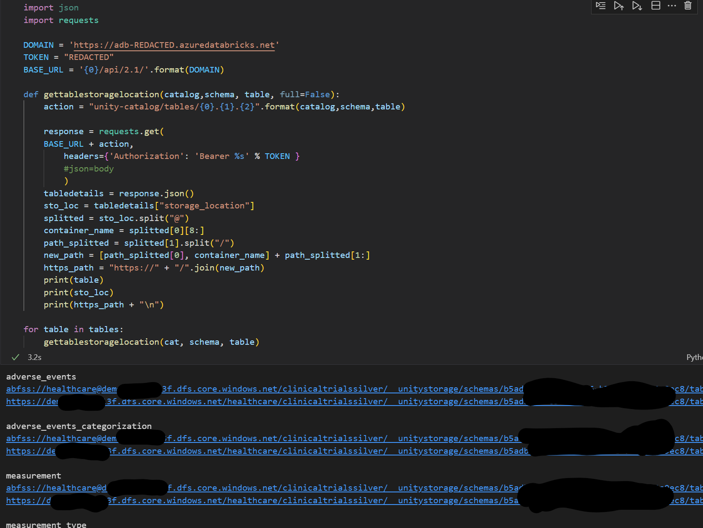
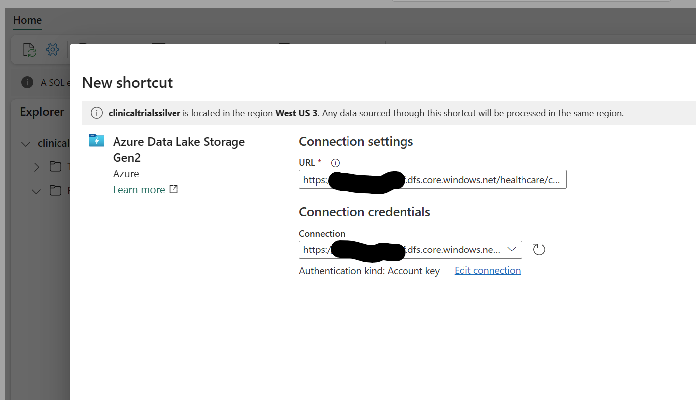
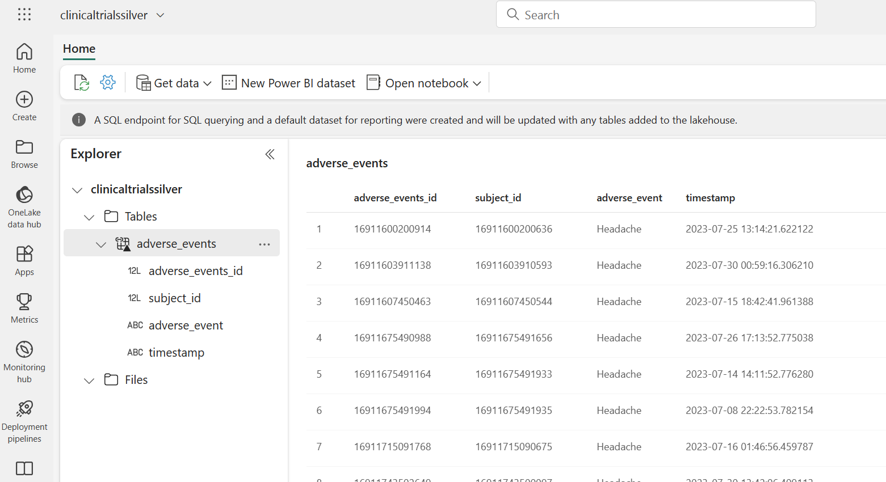
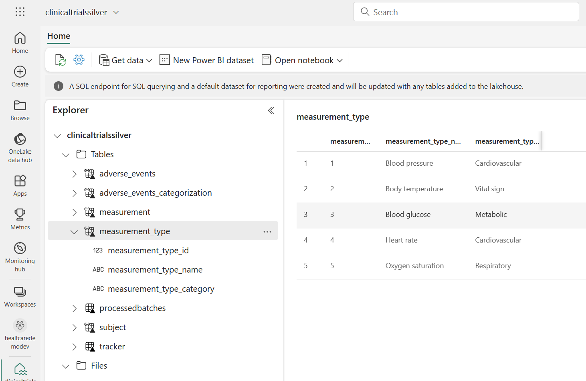
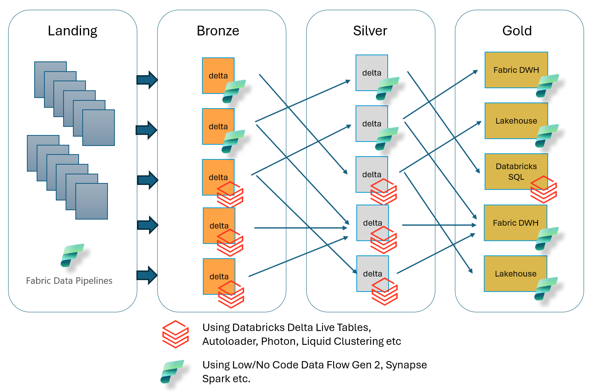

# Integrating Microsoft Fabric and Databricks Unity Catalog

This is a short guide on how to currently integrate Microsoft Fabric with Databricks Unity Catalog to get the best of both tools as well as an outlook how the integration might look like. Combining the tools you can get the best of both platforms with minimal effort. 

## Introduction

Although different platforms both Databricks and Microsoft Fabric embrace the Lakehouse concept ([Databricks](https://www.databricks.com/blog/2020/01/30/what-is-a-data-lakehouse.html), [Fabric](https://learn.microsoft.com/en-us/fabric/data-engineering/lakehouse-overview)) as well as using Delta-Parquet as the basis for the physical data layer.  

With the ability of using [OneLake-Shortcuts](https://learn.microsoft.com/en-us/fabric/onelake/onelake-shortcuts) in Microsoft Fabric you can directly work with tables defined in the Databricks Unity Catalog as if they were tables stored in the Fabric OneLake.  

## Setup

To follow along you need to have a [Microsoft Fabric Lakehouse](https://learn.microsoft.com/en-us/fabric/onelake/create-lakehouse-onelake). You either use an exisiting one or create a new one. I would suggest to have one Lakehouse for each schema in the Unity Catalog.  

For the Databricks part you need to have [Unity Catalog enabled](https://learn.microsoft.com/en-gb/azure/databricks/data-governance/unity-catalog/get-started) for your account and a metastore. Then you can create catalogs in this metastore from within your Databricks workspace as well as schemas in those catalogs and tables in those schemas.  

You should create your catalog with an external location pointing to a location in an Azure Data Lake Storage Gen2. 

Let´s assume i have a catalog called "healthcare" with a schema called "clinicaltrialssilver" and some tables in it called "subject", "adverse_events", "measurements".

 
## Create a shortcut to a Databricks Unity Catalog table

To work with those tables from Fabric you can easily create shortcuts. This way you can work with the data as if it was stored in the Fabric OneLake but it´s actually only a reference and no data is moved.  

To do so go to your Fabric Lakehouse and create a table shortcut.  

Choose ADLS Gen2 and build a connection. The only missing piece is to know the path where the Unity Catalog table´s delta files are actually stored. 
To do so either use the API, CLI or SDK of Databricks or navigate to the Catalog/Data section within your Databricks workspace and check the details section of the corresponding table.

(The code can be found for the apicalls is also in this repo)

Adjust the abfss-path to the corresponding https-path and you can complete the shortcut-setup.

You can now see the table in your Fabric Lakehouse.

As both the table definition in the Fabric Lakehouse as well as the Unity Catalog table are actually pointing to the same delta table in the ADLS they are exactly the same. They even share their delta-specific features like enabled change feed etc.

## Outlook

To avoid doing this process one by one you can use the Databricks API, CLI or SDKs to quickly extract the table details for each table in a specific schema or even for a whole catalog and create shortcuts for all of them.

As soon as we have the full Fabric API-capabilities in that regard you can easily sync your Unity catalogs with your Fabric Lakehouses and have both metalayers constantly in sync without moving any data and without additional effort.
 
Considering the big benefits of harmonizing both experiences hopefully we will soon get a functionality to sync Fabric Lakehouses with Databricks schemas on the data meta layer as well as on the permissions layer automatically.

## Reap the benefits

Integrating both experiences we get the best out of the two. We can have all the state-of-the-art data engineering capabilites from Databricks like Delta Live Tables, Auto Loader, Photon Engine, Liquid Clustering etc. paired with the full power of Fabric like the wide range of data integration scenarios, a Data Warehouse experience, real-time analytics, Power BI direct lake mode, Data Activator etc. 
Being able to use the Unity Catalog tables seamlessly from Fabric and the other way around gives you the full flexibility to choose the best tool for each task and still have a unified experience. 
Potentially we could see architectures like the following with close to zero integration effort.

